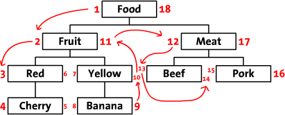
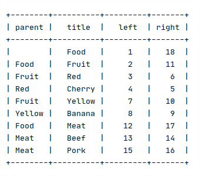
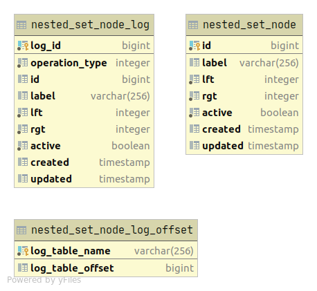

Kafka Connect Nested Set JDBC Sink Connector
===========================================

This is a [Kafka Connector](http://kafka.apache.org/documentation.html#connect)
for loading [nested set model](https://en.wikipedia.org/wiki/Nested_set_model) to any JDBC compatible database.


The Confluent [kafka-connect-jdbc sink connector](https://docs.confluent.io/current/connect/kafka-connect-jdbc/sink-connector/index.html) 
was already developed to allow exporting of data from Apache Kafka topics to any relational database.

This connector builts on top of the existing `kakfa-connect-jdbc sink connector` 
functionality and  provides a safeguard on the sink 
database side in order to avoid adding invalid updates to the nested set model.
The sinked nested set records will be placed in an `INSERT only` log table
and only when the nested set configuration is valid, the log records get
inserted to the destination sink table.


The project source code is a port of the Confluent's 
[kafka-connect-jdbc](https://github.com/confluentinc/kafka-connect-jdbc)
adapted to consistently sink nested set data.
This is why large portions of the `kafka-connect-jdbc` project code have
been copied and adapted.


## Nested set model

As stated on [Wikipedia](https://en.wikipedia.org/wiki/Nested_set_model)
> The nested set model is a technique for representing nested sets (also known as trees or hierarchies) in relational databases.

Details about the advantages of the nested set model are very well 
described in the following article:

https://www.sitepoint.com/hierarchical-data-database/






##Syncing nested set models over Apache Kafka

Bellow is described a concrete example to showcase the complexity associated
with syncing a nested set model over Apache Kafka.

Let's take the following example of going from a nested set model 
consisting only of the root node:

```
|1| A |2|
```

to the nested set model (after adding two children) consisting of 3 nodes:

```
|1| A |6|
    ├── |2| B |3|
    └── |4| C |5|
```

In the snippets above the tree node labels are prefixed by their `left` and `right`
nested set model coordinates.

Via `kafka-connect-jdbc` the records corresponding to the tuple updates may come in various
ordering:

```
| label | left | right |
|-------|------|-------|
| A     | 1    | 6     |
| B     | 2    | 3     |
| C     | 4    | 5     |
```
or
```
| label | left | right |
|-------|------|-------|
| B     | 2    | 3     |
| C     | 4    | 5     |
| A     | 1    | 6     |
```
or, in case that there's a problem on the jdbc source connector's side
```
| label | left | right |
|-------|------|-------|
| B     | 2    | 3     |
| C     | 4    | 5     |
```

or any other combinations of the three tuples listed above because the records
are polled in batches of different sizes from Apache Kafka. 


Going from the nested set model table content

```
| label | left | right |
|-------|------|-------|
| A     | 1    | 2     |
```
towards

```
| label | left | right |
|-------|------|-------|
| A     | 1    | 6     |
```

or 

```
| label | left | right |
|-------|------|-------|
| A     | 1    | 6     |
| B     | 2    | 3     |
```

would intermittently render the nested set model corrupt until
all the records from the source nested set model are synced over Apache Kafka.
In the unlikely case that there's an outage during a tree update on the Kafka Connect JDBC 
source connector side, the nested set model from the sink database side would stay corrupt
until the outage is fixed or until the nested set model would be manually adjusted. 


One solution to cope with this sync problem would be to separate 
the nested set model from what is synced over Apache Kafka. 




In the table diagram above, the `nested_set_node_log` table is an `INSERT only` table
in which is written whenever a new record(s) is read from Apache Kafka.
The `log_offset` table has only one tuple pointing to the last `nested_set_node_log` tuple id
processed when updating the `nested_set_node` table.

Whenever new records are read from Apache Kafka, there will be a transactional attempt 
to apply all the updates from `nested_set_node_log` made after the saved entry in the `log_offset`
table to the existing configuration of the `nested_set_node` nested set model.

If the applied updates lead to a valid nested set model configuration, then the `nested_set_node`
table will be updated and the log offset will be set to the latest processed `nested_set_node_log` entry.
Otherwise the `nested_set_node` table stays in its previous state. 


## Connector configuration

The connector configuration can be obtained by doing the following call on Kafka Connect REST API:

```bash
curl -s -X PUT http://localhost:8083/connector-plugins/NestedSetJdbcSinkConnector/config/validate --header 'Content-Type: application/json' -d $'{"connector.class": "com.findinpath.connect.nestedset.jdbc.NestedSetJdbcSinkConnector", "topics": "dummy"}' | jq
```


A sample configuration for the connector is shown below:

```json
{
    "name": "findinpath-sink",
    "config": {
        "name": "findinpath-sink",
        "connector.class": "com.findinpath.connect.nestedset.jdbc.NestedSetJdbcSinkConnector",
        "tasks.max": "1",
        "topics": "findinpath.nested_set_node",
        "connection.url": "jdbc:postgresql://sink:5432/sink?loggerLevel=OFF",
        "connection.user": "sa",
        "connection.password": "p@ssw0rd!sink",
        "pk.fields": "id",
        "table.name": "nested_set_node",
        "table.left.column.name": "lft",
        "table.rgt.column.name": "rgt",
        "log.table.name": "nested_set_node_log",
        "log.table.primary.key.column.name": "log_id",
        "log.offset.table.name": "nested_set_node_log_offset",
        "log.offset.table.log.table.column.name": "log_table_name",
        "log.offset.table.offset.column.name": "log_table_offset"
    }
}
```


## End to end tests

This project contains end to end tests for the _kafka-connect-nested-set-jdbc-sink_ connector:


Check [DemoNestedSetSyncTest.java](src/test/java/com/findinpath/connect/nestedset/jdbc/DemoNestedSetSyncTest.java)
for implementation details.

## Contribute

Source code: https://github.com/findinpath/kafka-connect-nested-set-jdbc-sink

Issue Tracker: https://github.com/findinpath/kafka-connect-nested-set-jdbc-sink/issues

## License

This project is licensed under the [Apache License](LICENSE)